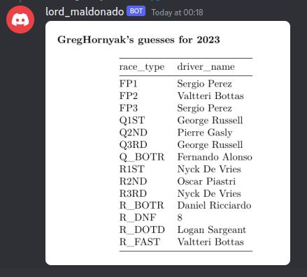

# Formula One Discord Bot

#### Automated bot for a Discord server

    

---

## Functionality

### Guess method

### Myguess method (returns a png)

### Setdate method

/date 2023 10 22 -> tell the bot when is the race first day

### Evaluate method

/eval -> calculate points for players

---

## Key Features

- Access to official results ✅
- Running continuously (on AWS) ✅
- User can make guesses on:
  - event ✅
  - driver ✅
- User can retrieve their guesses in form of a picture ✅
- Evaluate user guesses based on results ✅
- Inform clients on upcoming event date ✅
- Logging each interaction ✅
- Working in DM as well,
- Working parallelly, having multiple clients

---

## Content of repository

- [Rules](docs/rulebook.md)
- [Layout](docs/layout.md)
- [Commands](docs/commands.md)
- [User Stories](docs/user_stories.md)

---

## Use case

Open up Discord

Add the bot to your friends / join the group which involves it

IF you want to make a guess:

`!guess`

> or `!g` for shorter

Fill in the table with your guesses

Then wait until the race event

> the bot will notify you

Then evaluate your scores using

`!evaluate`

> `!e` for short

Retrieve the results in a score board

---

### Workflow

1. User makes a guess from the possible options.
2. The system saves the guess until the corresponding event occurs.
3. After the event, the system fetches the results and runs a comparison between the guesses and the results.

---

## System info

This bot was designed on Linux, meaning the setup is optimised for Linux distros.

The repository uses **python venv**, which needs to be initialised beforehand, and the required packages installed inside.  

A brief tutorial on setup is available [here](docs/setup.md).

### Mayor Update 1

**Formula One Discord Bot** is moving away from FastF1 Python package:

- the module isn't working properly,
- custom json requests are easier to make using Ergast directly

In the future, the Formula One Discord Bot is going to use Ergast as main information source for Race, Qualification, Finishing Status and Race schedules

### Mayor Update 2

**Formula One Discord Bot** is not going to use Ergast as primary API, because Ergast API is going to be deprecated in 2024.

---

## Components

The product: a Discord chatbot, listening and writing on a Discord feed / channel.

The core app, hosting the necessary files for the chatbot. Also making connection between the database and the Discord channel.
In addition, responsible for making the json requests from Ergast.

The database manager, handling the storing and retrieving actions, when dealing with the database(s).

The request_manager, handling the requests to Formula One official website.

~~logging machine~~

~~FastF1, a F1-API - a python package - fetching the F1 race data.~~

Formula One website as source

Discord.py Python package as API module

---

## Contributors

J. Gergely Hornyak as **developer**

Gabor Korecz as **technical support** and **testing**
