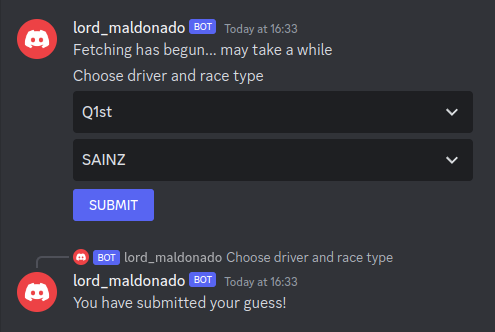
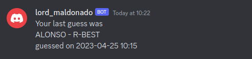
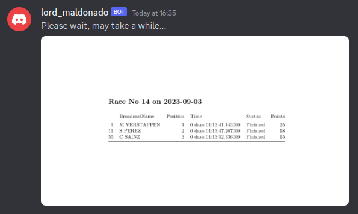

# Formula One Discord Bot

   

### Automated bot for a Discord server

*1) guess method*

*2) showlast method*

*3) last_results method (returns a png)*

---

## Key Features

- Running continuously (on AWS),
- User can make guesses on:
  - event,
  - driver
- User can retrieve their guesses in form of a picture,
- Access to official results,
- Evaluate user guesses based on results,
- Inform clients on upcoming event date,
- Working in DM as well,
- Working parallelly, having multiple clients,
- Logging each interaction.

---

## Content of repository

- [Rules](docs/rulebook.md)
- [Layout](docs/layout.md)
- [Commands](docs/commands.md)
- [User Stories](docs/user_stories.md)

---

## Use case

Open up Discord

Add the bot to your friends / join the group which involves it

IF you want to make a guess:

`!guess event score`

> the event is the name of the event, score is a number.

e.g. `!guess Top1 Verstappen` produces a guess of Verstappen being in the Top1.

OR:

`!guess2`

> this is a UI test

---

### Workflow

1. User makes a guess from the possible options.
2. The system saves the guess until the corresponding event occurs.
3. After the event, the system fetches the results and runs a comparison between the guesses and the results.

---

## System info

This bot was designed on Linux, meaning the setup is optimised for Linux distros.

The repository uses **python venv**, which needs to be initialised beforehand, and the required packages installed inside.  

A brief tutorial on setup is available [here](docs/setup.md).

## Mayor Update

**Formula One Discord Bot** is moving away from FastF1 Python package:

- the module isn't working properly,
- custom json requests are easier to make using Ergast directly

In the future, the Formula One Discord Bot is going to use Ergast as main information source for Race, Qualification, Finishing Status and Race schedules

---

## Components

The product: a Discord chatbot, listening and writing on a Discord feed / channel.

The core app, hosting the necessary files for the chatbot. Also making connection between the database and the Discord channel.
In addition, responsible for making the json requests from Ergast.

The database manager, handling the storing and retrieving actions, when dealing with the database(s).

A logging machine.

~~The F1-API - a python package - fetching the F1 race data.~~

---

## Contributors

J. Gergely Hornyak as **developer**

Gabor Korecz as **technical support** and **testing**

