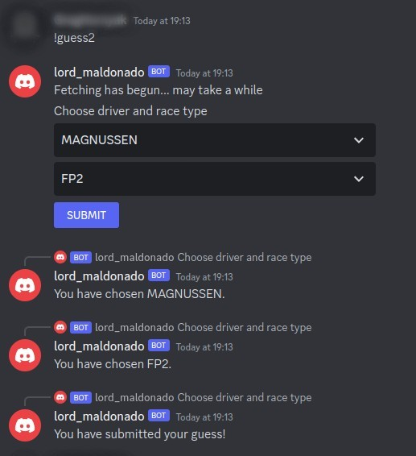

# Formula One Discord Bot

Automated bot for a Discord server

---

## Key Features

- Running continuously
- User can store guesses
- User can retrieve their guesses
- Updating database, based on official results
- The score for each user can be retrieved
- Bot can work in DM as well
- Bot can work parallelly, having multiple clients

---

## Content of repository

- [Rules](docs/rulebook.md)
- [Layout](docs/layout.md)
- [Commands](docs/commands.md)
- [User Stories](docs/user_stories.md)

---

## Use case

Open up Discord

Add the bot to your friends / join the group which involves it

IF you want to make a guess:

`!guess event score`

> the event is the name of the event, score is a number.

e.g. `!guess Top1 Verstappen` produces a guess of Verstappen being in the Top1.

OR:

`!guess2`

> this is a UI test

---

### Workflow

1. User makes a guess from the possible options.
2. The system saves the guess until the corresponding event occurs.
3. After the event, the system fetches the results and runs a comparison between the guesses and the results.

---

## System info

This bot was designed on Linux, meaning the setup is optimised for Linux distros.

The repository uses **python venv**, which needs to be initialised beforehand, and the required packages installed inside.  

A brief tutorial on setup is available [here](docs/setup.md).

---

## Components

The core app, reading the inputs, and responding to the user.

The database manager, handling the storing and retrieving actions when dealing with the database(s).

The F1-API - a python package - fetching the F1 race data.

---

## Contributors

J. Gergely Hornyak

Gabor Korecz **as revisioning**

