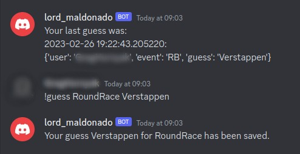

# Custom Formula One Discord Bot

Automated bot for a Discord server

## Key Features

- Running continuously
- User can store guesses
- User can retrieve their guesses
- Updating database, based on official results
- The score for each user can be retrieved
- Bot can work in DM as well
- Bot can work parallelly, having multiple clients

---

## Content of repository

- [Layout](docs/layout.md)
- [Commands](docs/commands.md)
- [User Stories](docs/user_stories.md)

---

## Use case

Open up Discord

Add the bot to your friends / join the group which involves it

IF you want to make a guess:

`!guess event score`

> the event is the name of the event, score is a number.

e.g. `!guess Top1 Verstappen` produces a guess of Verstappen being in the Top1.

OR IF you want to vote for your favourite party:

`!valasztas`

> this is a UI test

---

## System info

This bot was designed on Linux, meaning the setup is optimised for Linux distros.

---

## Components

The core app, reading the inputs, dealing with the database and responding to the user.

The database manager, handling the storing and retrieving actions.

The F1-API, a python package fetching the F1 race data.

---

## Contributors

J. Gergely Hornyak

Gabor Korecz **as revisioning**

