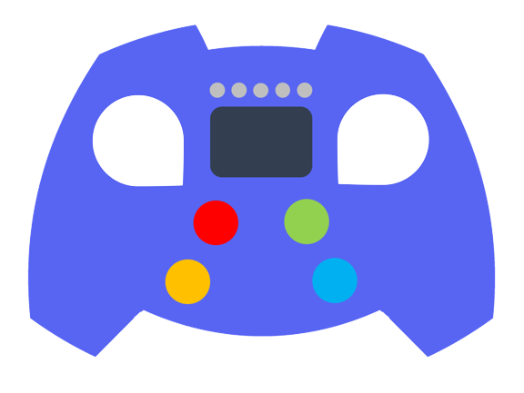

# Formula One Discord Bot

#### Automated bot for a Discord server to fetch Formula One results

    

---

## Functionality

### Guess

### See your guesses

### Evaluate your guesses based on the latest results

---

## Key Features

- Access to official results ✅
- Running continuously (on AWS) ✅
- User can make guesses on a driver or dnf for each event ✅
- User can retrieve their guesses in form of a picture ✅
- Evaluate user guesses based on results ✅
- Inform clients on upcoming event date ⏯
- Working parallelly, having multiple clients ✅
- 
---

## Content of repository

- [Commands](docs/commands.md)
- [Categories](docs/categories.md)

---

### Use case

1. User makes a guess from the possible options.
2. The system saves the guess until the corresponding event occurs.
3. After the event, the system fetches the results and runs a comparison between the guesses and the results.
4. The system evaluates the results and creates a score board for each player. 

---

## Contributors

J. Gergely Hornyak as **developer**

Gabor Korecz with **technical support** and **testing**

Marton Banfi as **tester**
